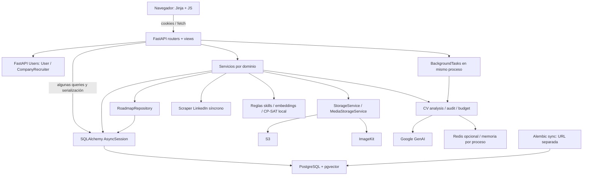

# Arquitectura actual

Fecha: 2026-09-05. Revisión local: `6a2ea29`. Auditoría estática y pruebas aisladas; no se conectó a producción ni se modificó código productivo. Las líneas son referencias al snapshot y pueden desplazarse.

## Stack comprobado

| Capa | Implementación y evidencia |
| --- | --- |
| Runtime | Python >=3.10 declarado en pyproject; imagen Python 3.12-slim en Dockerfile |
| Web/API | FastAPI, Uvicorn, routers registrados en app/app.py; entrypoint Docker app.app:app |
| Frontend | Jinja2, HTML/CSS y JavaScript vanilla en app/templates y app/static; fetch y estado local por pantalla; no React ni SPA observada |
| Contratos | Pydantic en app/schemas; serialización combinada en schemas, servicios y routers |
| Persistencia | SQLAlchemy AsyncSession; PostgreSQL mediante asyncpg, referencias a Neon/PgBouncer en app/db.py; ubicación real no verificada |
| Migraciones | Alembic con motor sync y URL propia en alembic.ini; múltiples ramas históricas/merges |
| Auth | FastAPI Users, JWT en cookies HttpOnly, SameSite=Lax, secure condicionado a ENV; identidades User y CompanyRecruiter separadas |
| Storage | S3 para CV/recursos, S3 o ImageKit para media; selección en storageService/mediaStorageService |
| IA | Google GenAI Gemini para keywords y auditoría de CV; extracción PDF/DOCX local; cuotas por usuario y presupuesto global |
| Analítica | skills normalizadas, extracción por reglas, embeddings hash o sentence-transformers, pgvector; heurística y OR-Tools CP-SAT |
| Jobs | FastAPI BackgroundTasks para análisis CV; no cola durable externa observada |
| Cachés | CounterStore Redis opcional o memoria local; análisis CV completado en DB; modelo embedding lru_cache por proceso |
| Empleos externos | Scraper guest LinkedIn con requests/BeautifulSoup; apify-client declarado pero no consumidor runtime confirmado |
| Notificaciones | EmailNotificationService.queue_mock_email escribe email_notification_logs; no envío real |
| Deployment | Docker/Uvicorn; configuración env; sin IaC/CI/CD versionado encontrado que pruebe el despliegue efectivo |
| Tests | pytest, pytest-asyncio, HTTPX ASGITransport, SQLite in-memory; cobertura configurada, sin lint/typecheck declarados |
| Pagos/cron/analytics externos | No encontrados en código activo revisado; AIQuotaGrant no equivale a una suscripción implementada |

Las versiones citadas son las declaradas en el repositorio, no recomendaciones de versiones actuales ni un inventario verificado del contenedor desplegado.

## Mapa real

## Flujos y límites existentes

**CV y búsqueda:** usuario autenticado carga archivo → ResumeService sube S3 y crea resumes → POST de análisis busca caché/trabajo activo → reserva cuota y persiste job_analysis → BackgroundTasks abre sesión nueva → descarga, extracción, guard y Gemini → resultado/consumo/summary → embedding. Jobs.js consulta estado cada 3 s hasta 20 veces. El cache hit evita Gemini; no asumir que todo acceso a Jobs gasta IA.

**Curso y candidatura:** upload de auditoría → evaluación Gemini versionada → score/pass/report persistidos → ApplicationService elige un CV aprobado con score >=8 → candidatura y evento/agregado. Recruiter cambia pipeline o publica disponibilidades. La ruta de entrevistas escribe estado por fuera del registrador de eventos. Email actual es mock transaccional, no entrega garantizada.

**Career Lab:** CV propio → extracción por reglas de summary o archivo si falta → skills revisables → requisitos de rol reales o fallback sembrado → matching/gap/cursos → optimización → optimization_runs conserva snapshot. No confundir hash embedding con similitud semántica de sentence-transformers ni match_strength mock de candidaturas con readiness de Capstone.

**Aprendizaje:** recursos con módulos/lecciones y progreso; evaluación aprobada puede completar virtualmente lección de CV. Dashboard recalcula desde tablas y persiste user_stats. Roadmaps tiene repo separado, tareas/proyectos/progreso propio y consultas agrupadas: son otro concepto del dominio.

**Comunidad:** posts generales y posts de comunidad coexisten; membresías, likes y comentarios pertenecen al segundo. Amistades habilitan conversaciones; messageService agrupa autores, últimos mensajes y no leídos, aunque carga historial completo al abrir conversación.

## Domain map y ownership

| Concepto | Creación / modificación | Lectura y consumidores | Autoridad actual y dependencias |
| --- | --- | --- | --- |
| User | FastAPI Users register/update; profileService | auth, views, comunidades, CV, candidaturas | users; padre de registros del estudiante |
| Company / Recruiter | companyRoute registro; companyRecruiterService y companyService | jobs, applicants, entrevistas | companies para organización; company_recruiters para credenciales/rol; auth legacy ya tiene migración de retiro |
| Questionnaire | questionnaireService.submit_questionnaire | perfil y dashboard | user_questionnaires answers/version/results + definición JSON; versión de lectura ambigua |
| Resume / evaluación / análisis | resumeService, ResumeCourseAuditService, CVAnalysisService | perfil, Jobs, Career Lab, applicants, ResourceService | resumes identidad/objeto; resultados específicos en tablas separadas; summary duplicado |
| AI usage / grants | reserve/commit_usage; concesiones persistidas en ai_quota_grants | cuotas y presupuestos | ledger + legacy + CounterStore; no hay billing real |
| JobPosting / Application | jobPostingService; ApplicationService y InterviewService | Jobs, dashboards, empresa | job_postings/candidaturas; estados duplicados como historial/proyección |
| Interview / email log | InterviewService, EmailNotificationService | candidato/recruiter | interview_availabilities y logs mock; dependen de candidatura |
| Resource / Lesson / progreso | AdminService catálogo; ResourceService progreso | recursos, dashboard, auditoría CV | resources/modules/lessons; progreso manual + evaluación derivada |
| Roadmap / tareas / proyectos | seeds; roadmapService mediante repo | páginas roadmap y guardados | tablas roadmap separadas de cursos; stage progress derivado |
| Skill / Course / OptimizationRun | seeds/extracción/revisión/optimizer Capstone | Career Lab | catálogo skills, links con provenance, courses y snapshots optimization_runs |
| Community / miembros / posts | communityService; admin | feed y perfil | membresías vs member_count manual; comunidad distinta de post general |
| Friendship / DM | friendshipService, messageService | perfil, feed, inbox | friend_requests, friendships, conversations/participants/messages |

Inventario por tabla, FKs y consumidores en [05_DATABASE_AUDIT.md](05_DATABASE_AUDIT.md).

## Server state y client/UI state

Server state: sesión efectiva, permisos, resultados CV, cuotas, estado de candidatura, progreso y skills. Frontend guarda copias de respuestas y las re-renderiza; no hay query cache central ni invalidación uniforme. Client/UI state: filtros, pestaña activa, modal abierto, upload seleccionado, carga/error y selección temporal de slot. Las copias del servidor no son un fallo por sí mismas: deben invalidarse tras mutación y no convertirse en autoridad para permisos/elegibilidad. Actualmente Jobs/Career Lab combinan ambos tipos y efectos de red en archivos grandes.

## Patrones que conviene conservar

StorageService/MediaStorageService aíslan proveedores reales; ResumeAuditEvaluator facilita pruebas; CounterStore tiene implementaciones Redis/memoria justificadas; RoadmapRepository concentra consultas complejas; skillNormalizer y courseCatalogQueries ya evitan duplicación. No introducir herencia general ni una capa repository por cada SELECT. El ciclo detectado estático applicationSchema→applicationService→applicationSchema incluye TYPE_CHECKING: no constituye evidencia de un ciclo runtime roto.
