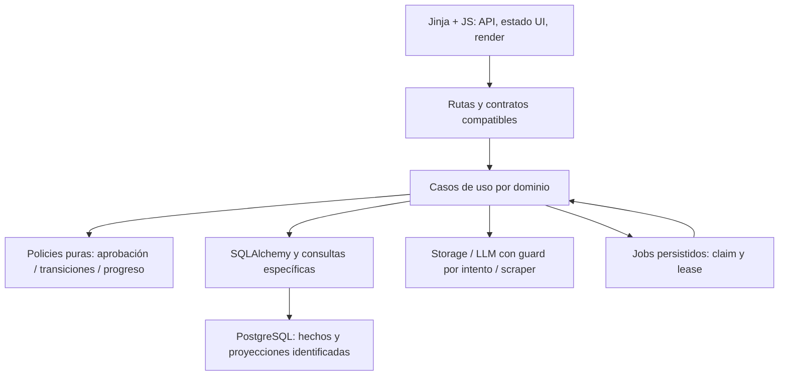

# Arquitectura objetivo y decisiones

Fecha: 2026-09-05. Revisión local: `6a2ea29`. Auditoría estática y pruebas aisladas; no se conectó a producción ni se modificó código productivo. Las líneas son referencias al snapshot y pueden desplazarse.

## Monolito modular incremental

Conservar app/routes, app/services/<dominio>, app/models y app/schemas. Las rutas hacen autenticación, parsing y mapping HTTP. Los servicios de aplicación coordinan transacciones; policies puras contienen invariantes compartidas; consultas se extraen cuando son complejas o reutilizadas. El ORM puede permanecer en un servicio pequeño: no añadir una capa que simplemente replique métodos SQLAlchemy.

No importar router/HTTP Request en policies; evitar que servicios de dominio importen componentes UI. DTOs de entrada/salida no son tablas. Actor/tenant se pasa explícitamente, no se toma de globals. La sesión pertenece a una operación; no usarla concurrentemente ni en threads. Un método interno usa flush y el coordinador decide commit. DB y S3 no comparten transacción: intención durable/compensación es necesaria donde hay riesgo de pérdida.

## Boundaries propuestos

| Módulo existente | Responsabilidad objetivo | Extracción mínima |
| --- | --- | --- |
| accounts / companies | identidad, perfil, rol y pertenencia | configuración auth compartida; policies de rol concretas |
| resumes / ai | documentos, evaluaciones, jobs y consumo | ResumeApprovalPolicy; lifecycle de evaluación; gateway de intento LLM |
| applications / jobs | candidatura y agenda | transición canónica + evento/proyección; bloqueo de candidatura |
| resources / applications dashboard | catálogo y progreso de aprendizaje | query/proyector de progreso único; dashboard read-only |
| roadmaps | planes, tareas y proyectos | conservar repositorio y distinguir hechos/progreso derivado |
| analytics | catálogo/skills, matching, optimización | facade actual delega a servicios pequeños, solver independiente de DB |
| community | feed, membresía, amistades y mensajes | ownership en mutaciones; contador derivado; paginación mensajes |
| storage / ratelimit | proveedores y límites de recursos | contratos de resultado/error; objetos únicos; store compartido en producción |

## Architecture Decisions

### ADR-001 — Mantener el monolito y fachadas existentes

**Context:** stack funcional, despliegue único, límites de dominio ya presentes y suite rápida verde.

**Decision:** refactorizar por caso de uso bajo las rutas/contratos actuales, sin microservicios ni cambio de frontend.

**Alternatives considered:** reescritura SPA, CQRS completo, repositorios genéricos por tabla.

**Why:** no hay evidencia de escala/equipos que compense la nueva infraestructura; el problema es propiedad de reglas y transacciones.

**Consequences:** algunas consultas ORM permanecen en servicios; facade de Capstone se conserva temporalmente con fecha/condición de retiro documentada.

### ADR-002 — Hechos, snapshots y proyecciones explícitos

**Context:** cuotas, progreso, membresías y candidaturas mezclan tablas autoritativas con caches manuales.

**Decision:** membresías y completados son hechos; evaluación con versión es snapshot; ledger IA es consumo de usuario; applications.status es estado actual, eventos historia desde corte conocido, agregados son reconstruibles. Embeddings y user_stats son caches, nunca permisos.

**Alternatives considered:** eliminar toda denormalización; event sourcing total; dual-write permanente.

**Why:** una proyección puede ser eficiente si se puede reconstruir y verificar. La historia anterior a eventos no se puede inventar.

**Consequences:** backfill por identidad, métricas de parity, reconstrucción y retención explícitas; ninguna tabla se borra en la primera transición. Umbral de aprobación sigue en 8, con versión de policy si cambia en el futuro.

### ADR-003 — Jobs y reservas durables con infraestructura mínima

**Context:** BackgroundTasks y objetos de reserva en memoria desaparecen al reiniciar; gasto y resultado no son una transacción distribuida.

**Decision:** ampliar job_analysis/ciclo de reservas y usar claim/lease en DB; un runner recuperable consume esa intención. Redis mantiene límites compartidos de corto plazo, no es autoridad única del gasto histórico.

**Alternatives considered:** Celery más broker, cola Redis paralela, repetir cualquier job fallido.

**Why:** ya hay tabla de jobs. Se necesita recuperación/idempotencia, no una plataforma de eventos.

**Consequences:** definir fase pre/post intento y reconciliar resultados inciertos; no prometer exactly-once del proveedor. Timeout o caída tras gasto requiere estado explícito, no retry ciego.

### ADR-004 — Objetos privados con autorización de aplicación

**Context:** claves colisionables, URLs persistidas y descargas por prefijo eluden política de catálogo.

**Decision:** identidad del objeto separada del nombre visible; autorización por entidad antes de obtener bytes/enlace temporal. Política del bucket debe verificarse operativamente; URL existente no prueba bucket público.

**Alternatives considered:** confiar en nombres difíciles de adivinar, hacer públicos todos los objetos, mover todo a otro proveedor.

**Why:** reduce pérdida de datos y acceso indebido sin cambiar de storage.

**Consequences:** conservar claves históricas como referencias, introducir intención durable para borrado; no migrar/cambiar permisos masivamente sin inventario y restore verificado.

## Contratos y compatibilidad

Mantener rutas y JSON públicos durante extracción. Tests de contrato fijan enums, claves, nulls, orden y códigos de error. Los errores inseguros cambian explícitamente a mensajes genéricos. Paginar exige nuevos parámetros/endpoint compatible y migración de consumidores antes de limitar la respuesta legacy. No convertir application.match_strength mock en gap score como parte de DRY. courses puede enlazar resources; uno es oferta para optimización, otro contenido pedagógico: no son tablas intercambiables.

## Reglas para cada PR

Cada regla sensible tiene una autoridad backend; se separa UI de server state. Cambios de comportamiento se rotulan Bug Fix. Primero characterization, después implementación nueva, migración de callers, parity y retiro legacy. Preferir composición, dependencias explícitas y funciones simples. No nuevos SDKs fuera del adapter correspondiente; no N+1 ni caches de PII sin necesidad demostrada. Medir antes/después de optimizaciones y documentar diferencias de resultados; no usar tests que solo repitan el algoritmo nuevo.
