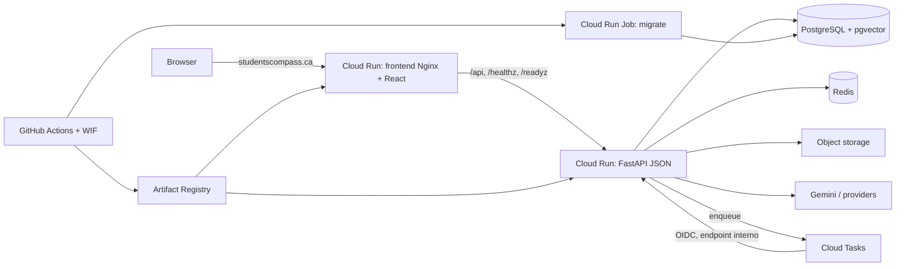

# Plan de refactor completo: API REST, React y Cloud Run

Fecha: 2026-09-06. Revisión local: `f9ca382` (`main`). Este plan reemplaza la
decisión de conservar Jinja del plan anterior para esta iniciativa. La auditoría
de dominio y de datos de `docs/refactor/` sigue siendo válida como insumo: esta
migración no autoriza a cambiar reglas de negocio ni a inventar datos históricos.

## 1. Resultado objetivo

StudentsCompass quedará como un monorepo con dos aplicaciones desplegables:

- `backend/`: FastAPI exclusivamente como API JSON versionada en `/api/v1`, más
  health checks, OpenAPI y endpoints internos autenticados para trabajo asíncrono.
- `frontend/`: SPA React + TypeScript + Vite. Nginx sirve el bundle y proxea
  `/api`, `/healthz` y `/readyz` al backend, igual que FinanceTracker.
- Producción: dos servicios de Cloud Run (`studentscompass-api` y
  `studentscompass-front`), un Cloud Run Job de migraciones y Cloud Tasks para
  disparar análisis durables de CV sin depender del ciclo de vida de una réplica.
- Un solo origen visible para el navegador. El dominio apunta al frontend; el
  frontend usa rutas relativas `/api/v1`, por lo que cookies, CSRF y navegación
  no dependen de CORS cross-site.
- La migración será incremental por verticales. El monolito actual seguirá
  funcionando hasta que cada pantalla React alcance paridad funcional y visual.

No se propone dividir el backend en microservicios. Los límites actuales por
dominio son suficientes; separar procesos y contratos aporta el valor buscado
sin introducir transacciones distribuidas entre dominios.

## 2. Línea base comprobada

En el snapshot revisado existen:

- FastAPI + SQLAlchemy async + Alembic + PostgreSQL/pgvector + Redis.
- `150` handlers declarados entre `app/routes` y `app/views`; `23` son rutas de
  vistas, no API.
- `27` templates Jinja, `23` archivos JavaScript y CSS por pantalla.
- API parcial bajo `/api/v1`, pero con nombres orientados a pantallas o acciones
  (`students_dashboard`, `toggle-active`, `join`, `save`, `keywords/analyze`).
- Dos identidades autenticables: estudiante y recruiter, con cookies separadas.
- Un runner durable de análisis de CV que arranca dentro de cada proceso web.
- Un solo `Dockerfile`, sin compose local equivalente a producción y sin pipeline
  de despliegue; CI actual cubre Python, PostgreSQL/Redis y navegador.
- Ejecución local del 2026-09-06: `403 passed, 50 skipped, 1 failed`. El fallo es
  `test_a_repeated_join_is_refused_and_changes_nothing`, por acceso ORM expirado
  fuera de `greenlet_spawn` después de `AlreadyMemberError`.

La fase 0 no termina hasta resolver o caracterizar ese fallo y obtener una suite
repetible en la versión de Python que usará la imagen de producción.

## 3. Arquitectura objetivo



El frontend es el único servicio con dominio público. Para reproducir exactamente
el patrón de FinanceTracker, Nginx hace proxy al URL de Cloud Run de la API. Ese
URL puede seguir siendo invocable sin autenticación de IAM, aunque todos los
recursos privados exigen autenticación de aplicación, CSRF y rate limits. Si se
requiere que la API sea privada también a nivel IAM, el proxy Nginx simple no
basta: deberá sustituirse por un HTTPS Load Balancer con serverless NEGs y
routing `/api/*`, o por un proxy capaz de emitir identity tokens. Esa decisión es
un gate de infraestructura, no se debe dejar implícita.

## 4. Layout final del repositorio

```text
StudentsCompass/
├── backend/
│   ├── app/
│   │   ├── api/v1/              # routers HTTP finos por dominio
│   │   ├── core/                # config, errores, seguridad, observabilidad
│   │   ├── models/
│   │   ├── repositories/        # solo consultas complejas/reutilizadas
│   │   ├── schemas/             # contratos Pydantic públicos
│   │   └── services/            # casos de uso y reglas de negocio
│   ├── alembic/
│   ├── tests/
│   ├── Dockerfile
│   ├── pyproject.toml
│   └── uv.lock
├── frontend/
│   ├── public/
│   ├── src/
│   │   ├── app/                 # router, providers, guards
│   │   ├── api/                 # cliente, tipos generados, query keys
│   │   ├── components/          # sistema de diseño compartido
│   │   ├── features/            # verticales de producto
│   │   ├── i18n/
│   │   ├── lib/
│   │   └── styles/
│   ├── Dockerfile
│   ├── nginx.conf
│   ├── package.json
│   └── vite.config.ts
├── docker-compose.yml
├── .github/workflows/ci.yml
├── .github/workflows/deploy.yml
└── docs/refactor/
```

El movimiento inicial a `backend/` debe hacerse con `git mv` y sin refactorizar
imports o comportamiento en el mismo PR. Primero se demuestra que el código
movido pasa la misma suite; después se cambia su arquitectura interna.

## 5. Decisiones de contrato REST

### 5.1 Convenciones

- Prefijo público estable: `/api/v1`.
- URLs con sustantivos plurales y `kebab-case`; no nombres de templates.
- `GET` lee, `POST` crea o inicia una operación, `PUT` reemplaza una relación
  idempotente, `PATCH` actualiza parcialmente y `DELETE` elimina.
- Códigos: `200` lectura/actualización, `201` creación, `202` job asíncrono,
  `204` borrado sin body, `400` sintaxis, `401` sin sesión, `403` sin permiso,
  `404` inexistente, `409` conflicto/idempotencia, `422` validación y `429` cuota.
- Recursos directos se devuelven sin envelope. Colecciones paginadas usan
  `{"items": [...], "page": 1, "page_size": 20, "total": 100}`.
- Error único: `{"error":{"code":"stable_code","message":"texto seguro",
  "details":{},"request_id":"..."}}`. Nunca se retorna `str(exception)`.
- Fechas ISO 8601 con zona horaria UTC; enums como valores estables, no etiquetas.
- Paginación por cursor en mensajes/feed y por página donde el catálogo requiere
  saltos. Toda colección debe tener límite máximo de servidor.
- `Idempotency-Key` en candidaturas, uploads que disparan IA y creación de jobs.
- OpenAPI es la fuente de verdad del contrato. CI exporta el schema y genera o
  verifica tipos TypeScript; un diff incompatible falla salvo cambio versionado.

### 5.2 Normalización prioritaria de endpoints

No es necesario renombrar los 150 handlers en un solo PR. Se crea el contrato
nuevo, se mantiene temporalmente un adapter legacy y se retira cuando React deje
de consumirlo.

| Contrato actual | Contrato objetivo | Semántica |
| --- | --- | --- |
| `GET /students_dashboard` | `GET /dashboard/student` | presenter de estudiante |
| `GET /company_dashboard` | `GET /companies/me/dashboard` | presenter de recruiter |
| `GET/PATCH /profile` | `GET/PATCH /users/me` | perfil de la sesión |
| `GET /profile/cv` | `GET /resumes` | colección propia |
| `POST /profile/cv/upload` | `POST /resumes` | multipart; `201` |
| `DELETE /profile/cv/{id}` | `DELETE /resumes/{id}` | ownership obligatorio |
| `POST /profile/cv/course-audit-upload` | `POST /resume-course-audits` | crea auditoría/job |
| `GET /profile/cv/course-audit-attempts` | `GET /resume-course-audits` | historial paginado |
| `POST /jobs/keywords/analyze` | `POST /cv-analyses` | inicia job; `202` |
| `GET /jobs/keywords/{job_id}` | `GET /cv-analyses/{id}` | estado/resultados |
| `POST /jobs/search` | `POST /job-searches` | crea búsqueda externa reproducible |
| `POST /communities/{id}/join` | `PUT /communities/{id}/members/me` | relación idempotente |
| `DELETE /communities/{id}/leave` | `DELETE /communities/{id}/members/me` | elimina relación |
| `POST /roadmaps/{slug}/save` | `PUT /roadmaps/{slug}/saves/me` | relación idempotente |
| `DELETE /roadmaps/{slug}/save` | `DELETE /roadmaps/{slug}/saves/me` | elimina relación |
| `POST /friends/requests/{id}/accept` | `PATCH /friend-requests/{id}` | `{status: accepted}` |
| `POST /applications/{id}/interview-selection` | `PUT /applications/{id}/selected-interview` | selección idempotente |
| `PATCH /admin/users/{id}/toggle-active` | `PATCH /admin/users/{id}` | `{is_active: bool}` |
| `GET /resources/file?key=...` | `GET /resources/{id}/file` | autorización por entidad, no por key |

Las operaciones analíticas (`extract`, `sync`, `optimize`, `evaluate`) pueden
seguir como subrecursos/comandos explícitos cuando crean una ejecución auditable;
deben devolver un recurso `run` con identidad, estado y versión, no un efecto
anónimo.

### 5.3 Compatibilidad y retiro

Para cada endpoint:

1. Crear characterization tests del payload y permisos actuales.
2. Implementar contrato REST nuevo delegando al mismo caso de uso.
3. Añadir tests de schema, errores, ownership e idempotencia.
4. Migrar el consumidor React.
5. Medir llamadas al endpoint legacy durante al menos un ciclo de release.
6. Marcarlo deprecated en OpenAPI y devolver headers `Deprecation`/`Sunset`.
7. Retirarlo en una versión posterior; nunca mantener dual-write permanente.

## 6. Backend objetivo

### 6.1 Capas

- Routers: autenticación/autorización, parsing, status HTTP y serialización.
- Casos de uso: una transacción por operación y reglas de negocio coordinadas.
- Policies puras: aprobación de CV, transiciones, permisos y cálculo de progreso.
- Repositories: solamente queries complejas o compartidas; no CRUD genérico.
- Gateways: storage, email, Gemini, embeddings, scraper y Redis detrás de
  interfaces pequeñas y testeables.

Se conserva la separación de dominio actual (`accounts`, `companies`, `resumes`,
`applications`, `jobs`, `resources`, `roadmaps`, `community`, `analytics`, `ai`).
Los hallazgos de consistencia, seguridad y fuentes de verdad del plan anterior se
resuelven dentro de cada vertical antes de declarar paridad.

### 6.2 Autenticación y CSRF

- Mantener cookies httpOnly y `SameSite=Lax`; `Secure` obligatorio en producción.
- Conservar inicialmente cookies separadas para estudiante y recruiter para no
  mezclar modelos de identidad durante la migración.
- Añadir `GET /api/v1/auth/session`, que devuelve el actor efectivo y su tipo, y
  endpoints de login/logout consistentes por actor.
- Añadir protección CSRF double-submit para todos los métodos mutantes y un
  cliente React que envía automáticamente `X-CSRF-Token`.
- Rotación/refresh de sesión explícita; el cliente reintenta una sola vez un 401.
- Autorización se decide en backend. Guards de React solo controlan navegación.
- CORS queda limitado al origen del frontend para desarrollo o acceso directo;
  no se considera una barrera de seguridad.

### 6.3 Jobs y ejecución en Cloud Run

El runner actual dentro del lifespan no debe ser el mecanismo principal en
producción: escala con cada réplica y una instancia a cero no ejecuta polling.

- `job_analysis` permanece como fuente durable de estado, lease e idempotencia.
- Al crear un análisis, la API persiste el job y encola una Cloud Task después del
  commit; una tabla/outbox evita perder el dispatch entre DB y Cloud Tasks.
- Cloud Tasks llama `/internal/tasks/cv-analyses/{id}` con OIDC y retry acotado.
- El handler reclama el lease atómicamente y retorna éxito ante replay terminal.
- Un Cloud Scheduler de reconciliación puede reencolar jobs vencidos; no procesa
  IA directamente.
- Localmente, un servicio `worker` de compose consume la misma outbox para no
  depender de Google Cloud.

Si Cloud Tasks no se aprueba, la alternativa es un tercer servicio Cloud Run
worker con `min-instances=1`; debe presupuestarse explícitamente. No se debe
mantener un loop oculto en todas las réplicas web.

### 6.4 Operación de la API

- `/healthz`: proceso vivo, sin tocar DB ni proveedores.
- `/readyz`: DB y dependencias indispensables con timeout corto.
- Logs JSON con `request_id`, actor anonimizado, ruta, status, latencia y job id.
- Métricas: 5xx, p95, pool DB, 429, jobs por estado/edad, gasto IA, reintentos y
  errores de storage.
- OpenAPI disponible como artefacto de CI; en producción puede restringirse.
- Migraciones solo mediante Cloud Run Job, nunca al arrancar cada réplica.

## 7. Frontend React objetivo

Stack recomendado, alineado con FinanceTracker:

- React 19, TypeScript estricto, Vite y React Router.
- TanStack Query para server state, invalidación y polling de jobs.
- React Hook Form + Zod para formularios; el backend sigue siendo autoridad.
- Tailwind v4 o tokens CSS extraídos del diseño existente; elegir uno y evitar
  convivir indefinidamente con 23 hojas CSS por pantalla.
- Vitest + Testing Library; Playwright para flujos críticos.
- i18next desde el inicio si se mantendrán varios idiomas.

```text
frontend/src/
├── app/                    # providers, router, guards
├── api/
│   ├── client.ts           # credentials, CSRF, refresh, ApiError, request id
│   ├── generated/          # tipos derivados de OpenAPI
│   └── queryKeys.ts
├── components/
│   ├── primitives/         # Button, Input, Dialog, Table, Badge...
│   ├── patterns/           # EmptyState, AsyncBoundary, DataTable...
│   └── layout/             # PublicShell, StudentShell, CompanyShell, AdminShell
├── features/
│   ├── auth/               # páginas, hooks y componentes del dominio
│   ├── dashboard/
│   ├── profile-resumes/
│   ├── jobs-applications/
│   ├── resources-roadmaps/
│   ├── community-messages/
│   ├── career-lab/
│   ├── company/
│   └── admin/
├── i18n/
├── lib/                    # formato, semántica, fechas, URLs seguras
└── styles/
```

Reglas:

- Una única capa HTTP; ningún componente llama `fetch` directamente.
- Las páginas componen; la lógica de red vive en hooks de feature.
- Datos remotos no se duplican en stores globales. TanStack Query es su cache.
- Roles, elegibilidad y permisos vienen del backend; React no recalcula reglas.
- Todo HTML de usuario se renderiza como texto salvo sanitización explícita.
- Accesibilidad: teclado, foco, labels, contraste y estados loading/error/empty.
- `index.html` y manifest sin cache; assets con hash e `immutable`.
- El service worker, si se agrega, nunca cachea respuestas autenticadas de `/api`.

## 8. Estrategia de migración por verticales

Orden recomendado por riesgo y dependencia:

1. **Shell público y auth**: home, about, login, registro, sesión, logout.
2. **Perfil, cuestionario y CV**: cubre uploads, permisos y base del resto.
3. **Dashboard estudiante, recursos y roadmaps**: resuelve progreso compartido.
4. **Jobs, análisis y candidaturas**: introduce Cloud Tasks y polling durable.
5. **Company**: dashboard, postings, applicants, entrevistas y recruiters.
6. **Community, friendships y messages**: paginación, estado optimista y tiempo real
   solo si hay requerimiento; no introducir WebSockets por defecto.
7. **Career Lab / Capstone**: conservar versiones, provenance y snapshots.
8. **Admin**: último consumidor; elimina toggles y uploads legacy.

Cada vertical incluye API REST, tipos, UI React, tests, observabilidad y retiro de
su JS/template legacy. No existe una fase donde se construya todo el backend y
meses después se pruebe el frontend por primera vez.

## 9. Fases de ejecución y entregables

### Fase 0 — Baseline y decisiones (1 sprint)

- Resolver el fallo actual y fijar Python/Node.
- Inventariar endpoints, consumidores, payloads y matriz legacy → REST completa.
- Capturar fixtures JSON y screenshots de las 16+ pantallas reales.
- Registrar ADRs: patrón de ingreso, API pública/IAM, CSRF, jobs y estrategia de
  compatibilidad.
- Auditar secretos, migraciones Alembic desde cero y restore de DB/storage.

**Exit gate:** fast, integration y browser lanes verdes; OpenAPI y baseline
visual archivados; decisiones de infraestructura aprobadas.

### Fase 1 — Reorganización del monorepo (1 sprint)

- Mover Python a `backend/` sin cambiar comportamiento.
- Adoptar `uv.lock` como única fuente de dependencias y Docker multi-stage non-root.
- Crear scaffold `frontend/` y `docker-compose.yml` con `migrate`, `api`, worker
  local y `web`.
- CI separada para backend y frontend.

**Exit gate:** misma suite backend después del move; frontend lint/typecheck/test/
build; smoke local a través de Nginx.

### Fase 2 — Plataforma REST y frontend (1–2 sprints)

- Error model, request id, paginación, idempotencia, sesión/CSRF y cliente HTTP.
- Schema OpenAPI estable y generación de tipos TypeScript.
- Design tokens, shells, router, guards, boundaries y componentes base.
- Health/readiness y logging estructurado.

**Exit gate:** registro/login/session/logout y una mutación CSRF funcionan a
través del proxy; contrato incompatible falla en CI.

### Fase 3 — Migración por verticales (4–8 sprints)

- Ejecutar las ocho verticales en el orden de la sección 8.
- Mantener adapters legacy de solo compatibilidad.
- Corregir en cada dominio las fuentes de verdad y concurrencia identificadas en
  `02_AUDIT_FINDINGS.md`; no portar bugs conocidos como diseño nuevo.

**Exit gate por vertical:** paridad funcional, tests de permisos y errores,
comparación visual, métricas sanas y cero tráfico frontend al contrato legacy.

### Fase 4 — Infraestructura Cloud Run (1–2 sprints, en paralelo desde fase 2)

- Artifact Registry con dos imágenes: `studentscompass/api` y `front`.
- Workload Identity Federation para GitHub; sin JSON keys persistentes.
- Secret Manager para DB, Redis, JWT, storage, Gemini y proveedores.
- Servicios Cloud Run con service accounts distintas y mínimo privilegio.
- Job `studentscompass-migrate` usando exactamente la imagen API del SHA.
- Cloud Tasks + OIDC para CV analysis y scheduler de reconciliación.
- Dominio, TLS, alertas, budgets y rollback por revisión.

**Exit gate:** staging desplegado desde CI, migración bloqueante, smoke end-to-end,
task replay seguro y rollback probado.

### Fase 5 — Cutover y retiro (1 sprint + observación)

- Ensayo de cutover con copia anonimizada o entorno staging equivalente.
- Congelar cambios incompatibles y aplicar migraciones expand/contract.
- Desplegar migrate → API → frontend, en ese orden.
- Canary o reparto gradual de tráfico si la configuración lo permite.
- Observar autenticación, 4xx/5xx, latencia, jobs, cuotas IA y storage.
- Retirar `app/views`, templates, JS/CSS legacy, Jinja, StaticFiles y endpoints
  deprecados solo después de la ventana de estabilidad.

**Exit gate:** React atiende el 100 %, rollback probado, cero consumo legacy y
runbook operativo entregado.

## 10. CI/CD equivalente a FinanceTracker

`ci.yml`:

- Backend: `uv sync --frozen`, `uv lock --check`, Ruff, typecheck si se adopta,
  pytest fast, integration PostgreSQL/pgvector + Redis y export OpenAPI.
- Frontend: `npm ci`, lint, `tsc --noEmit`, Vitest, validación i18n, build y tests
  contra tipos OpenAPI actuales.
- E2E: Playwright sobre compose o staging efímero para auth, upload CV,
  candidatura, entrevista y permisos recruiter/admin.
- Escaneo de secretos/dependencias e imágenes; no imprimir variables sensibles.

`deploy.yml`, disparado solo tras CI exitoso del mismo SHA:

1. Autenticar con WIF.
2. Construir y publicar `api:${SHA}` y `front:${SHA}`.
3. Actualizar y ejecutar `studentscompass-migrate --wait`.
4. Desplegar API por revisión sin tráfico y ejecutar smoke/readiness.
5. Promover API.
6. Desplegar frontend apuntando al origen de la API y promoverlo.
7. Actualizar configuración de Cloud Tasks/Jobs que comparte la imagen API.
8. Probar por el dominio público `/readyz`, sesión y un endpoint público.
9. Ante fallo, no promover; rollback de código a la revisión previa. Las
   migraciones deben ser backward-compatible para que ese rollback sea posible.

Nunca usar `:latest` como referencia de despliegue efectiva; puede publicarse por
comodidad, pero Cloud Run debe recibir el tag SHA o digest.

## 11. Configuración de Cloud Run

Valores iniciales a medir y ajustar, no defaults eternos:

| Recurso | Configuración inicial |
| --- | --- |
| API | 1 CPU, memoria según carga de embeddings/OR-Tools, concurrency 20–40, timeout acorde a requests síncronos, min 0 en staging |
| Frontend | 1 CPU, 256–512 MiB, concurrency alta, min 0 |
| Migrate job | 1 task, sin paralelismo, timeout suficiente, acceso a DB |
| Cloud Tasks | retry exponencial, límite de dispatch alineado con cuota Gemini, OIDC |
| DB pool | `pool_size × max_instances` por debajo del límite real de PostgreSQL/PgBouncer |
| Redis | obligatorio en producción para rate limits y cuotas compartidas |

La imagen API no incluirá templates ni assets React. La imagen frontend no
contendrá secretos: solo configuración pública; `API_ORIGIN` se inyecta en Nginx,
no en el bundle.

## 12. Estrategia de datos y migraciones

- Alembic es la única autoridad de schema; `create_all` queda solo para tests.
- Patrón expand/contract: agregar nullable/default → backfill idempotente → dual
  read temporal si hace falta → cambiar writers/readers → constraint → retirar.
- Migraciones nunca llaman APIs externas ni hacen backfills ilimitados.
- Backfills grandes son Jobs separados, reanudables y observables.
- Antes de cada cambio destructivo: conteos, backup, restore verificado y query de
  rollback. No inventar historia de eventos faltantes.
- No cambiar IDs ni storage keys al mover carpetas del repo.

## 13. Pruebas y criterios de calidad

Pirámide mínima:

- Unitarias: policies, servicios, formatters, componentes y hooks.
- Contrato API: status, JSON, enums, nulls, ownership, errores e idempotencia.
- Integración: PostgreSQL/pgvector, Redis, Alembic desde vacío y concurrencia.
- Frontend: componentes y páginas con Mock Service Worker o fixtures validadas.
- E2E: estudiante, recruiter y admin; happy path y acceso prohibido.
- Visual: screenshots desktop/mobile de cada pantalla migrada.
- Performance: p95, conteo de queries y tamaño de bundles; budgets en CI.

Un dominio no está migrado si solo “se ve”: debe conservar permisos, estados de
error, navegación profunda, refresh, uploads, reintentos y accesibilidad.

## 14. Riesgos y mitigaciones

| Riesgo | Mitigación |
| --- | --- |
| Big-bang rompe producto | Verticales, adapters legacy, flags y cutover tardío |
| React replica reglas | Backend devuelve decisiones; tests de paridad |
| Cookies fallan entre servicios | Un solo origen público y proxy `/api` |
| CSRF por cookies | Double-submit + SameSite + validación Origin |
| Contrato cambia sin detectar | OpenAPI versionado, tipos generados y contract diff |
| Jobs se pierden al escalar a cero | DB/outbox + Cloud Tasks + lease/idempotencia |
| Dos runners gastan IA | Un task por job y claim atómico; sin loop por réplica |
| Pool DB agota conexiones | Budget global de conexiones y max instances |
| Migración impide rollback | Expand/contract y migrate antes de tráfico |
| Frontend cachea PII | No cachear API en service worker; headers privados |
| API directa elude Nginx | Auth/CSRF/rate limit en FastAPI; decidir IAM/LB explícitamente |
| Refactor tapa bugs actuales | Baseline verde y cambios de comportamiento separados |

## 15. Definition of Done global

- FastAPI no importa Jinja, no monta `/static` y no sirve pantallas.
- Todo endpoint público está bajo `/api/v1` salvo health, readiness, OpenAPI y
  callbacks técnicamente justificados.
- React implementa todas las rutas públicas, student, company y admin.
- No existe `fetch` fuera del cliente/hook autorizado del frontend.
- Auth usa cookies seguras, CSRF, refresh acotado y permisos backend.
- Jobs IA sobreviven deploys, escala a cero y replays sin doble gasto efectivo.
- Dos imágenes reproducibles se despliegan por SHA mediante WIF.
- Migraciones corren como Job bloqueante y fueron probadas desde vacío.
- CI backend/frontend/integration/browser/E2E está verde.
- Dashboards y alertas cubren errores, latencia, DB, jobs y costo IA.
- Templates, JS/CSS legacy, dependencias Jinja y endpoints deprecated fueron
  retirados después de comprobar cero tráfico.
- Hay runbooks de deploy, rollback, restore, secretos y respuesta a jobs atascados.

## 16. Primer backlog ejecutable

1. Corregir la baseline de tests y fijar toolchains.
2. Crear ADR de ingreso Cloud Run: proxy público como FinanceTracker vs LB privado.
3. Generar inventario machine-readable de rutas y matriz legacy → REST.
4. Capturar OpenAPI, fixtures y screenshots actuales.
5. Mover el backend a `backend/` en un PR puramente mecánico.
6. Crear scaffold React y compose local con proxy same-origin.
7. Implementar error model, request id, sesión y CSRF.
8. Migrar auth + shell público como primera vertical.
9. Preparar WIF, Artifact Registry, Secret Manager y staging.
10. Implementar outbox + Cloud Tasks antes de migrar Jobs/Career Lab.

Este orden crea una ruta de entrega continua: desde el segundo sprint existe una
vertical completa sobre la arquitectura final, mientras el resto del producto
sigue atendido por el sistema actual.
